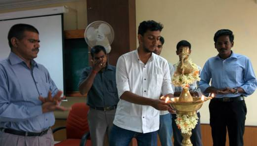
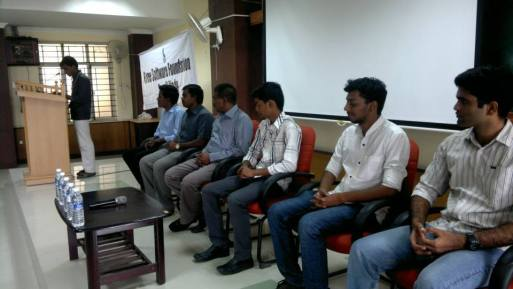
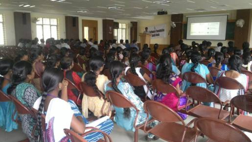

Title:GLUG UCEV
Date: 2014-07-03 10:20
Category: Post

GNU/Linux Users Group was started in Aug 2, 2014. **Me**, [**Ragulkanth**](ragulkanth.github.io), [**Manimaran**](https://manimaran96.wordpress.com) were organized and inaugurated the GLUG. The main objective of that GLUG is to enhance the technical knowledge of ourself and our friends by sharing and learning method and also there by creating awareness about existence of Free Softwares. GLUG UCEV is a part of [Free Software Foundation Tamil Nadu](fsft.org). It is the first event organized by us. That was really an wonderful experience gained more knowledge and through that personally I have developed my leadership and management skill little. Though we have faced so many obstacals, we successfully inaugurated and also we learnt that how to coordinate the works of others. 

**Dr. Senthil Dean, UCEV** has inaugurated the GNU/Linux Users Group. We had **Mr. Karkee, Mr. Balaji, Mr. Yogesh, Mr. Alagunambi Welkin, Mr. Khaleel Jageer** over there they have delievered lot of information about free softwares and philosophy behied it. 

**Mr. Karkee Udhayan** Handled the Philosophy behind Free software.
###Philosophy behind free software
Free softwares are the sort of softwares, which concentrate on the liberation of user. It provide four basic freedoms which are
1. **Freedom (0)** Freedom to run the program for any purpose
2. **Freedom (1)** Freedom to read the source code 
3. **Freedom (2)** Freedom to redistribute the extra copies
4. **Freedom (3)** Freedom to distribut the modified versions.
This sessions were went interactively, and he had his stage on his hand.

**Mr. Khaleel Jageer** showed many alternative softwares available for proprietary softwares
##Some alternatives for proprietary softwares
1. MS Office - Libreoffice
2. Photoshop - GIMP (GNU Image Manipulation Program)
3. Adobe illustrator - Inkscape
4. 3D max - Blender
5. Windows Media player - VLC
6. Microsoft Windows - GNU/Linux
7. Internet explorer - Mozilla Firefox, etc.

We got many volunteers from our college joined with us and helped us to make this event successfull. We have conducted various short sessions on various topics of Free Software such as GNU/Linux, Mozilla, etc. It was ended with a lots of knowledge. 
