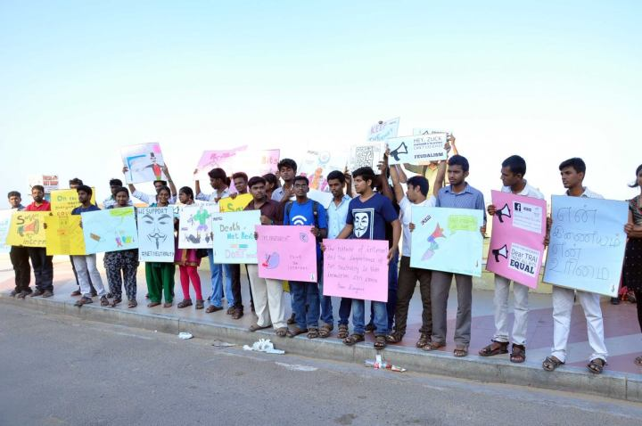

Title:#Net Neutrality Compaign
Date: 2015-04-25 10:20
Category: Post
{:height="300px" width="450px"}

Net Neutrality means that Internet should be neutral and it is an public property. No one has the rights to take internet as their own. Violation to Net Neutrality in the sense that many ISPs such as Reliance, Airtel and companies like Facebook were trid to make the internet as their own property by getting revenue from the people as their own wished way. Peoples barely use their service and lose their rights over the internet. Every one should aware that internet is common to everyone. What Facebook did is, it got tieup with reliance and provide the service called **internet.org**. In that plan they provide free access for limited number of sites (36 sites, Facebook is one among that) those who are using reliance network. It actually seems to bee a good plan for the common users but where it lead is, no people will know about the vast web beyond these 36 which they have provide. Through this, they can restrict the developement of the new companies, no one can reach the people through the internet etc. can be achieved by them. 

On behalf of Free Software Foundation Tamil Nadu, We protest against the **Voilation to Net Neutrality** there by showed our opposition to *internet.org* to **Telecom Regulatory Athority of India** at Besant Nagar, Chennai on **Apr 23, 2015**.
