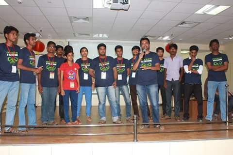
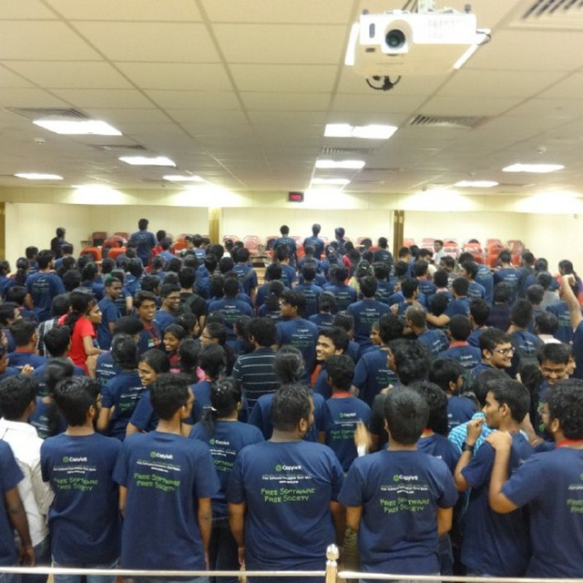
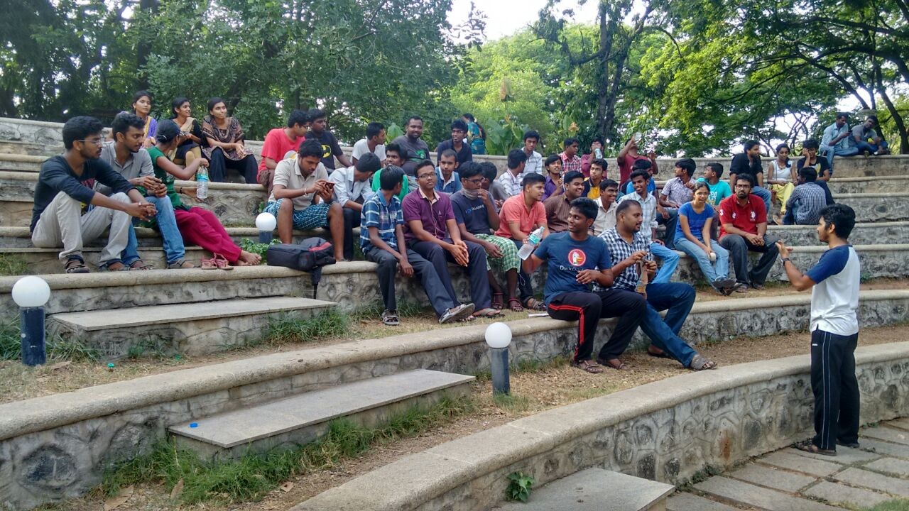

Title:Summer Camp 2k15
Date: 2015-06-25 10:20
Category: Post
{:height="300px" width="450px"}

{:height="300px" width="450px"}

{:height="300px" width="450px"}

Summer Camp 2015, was a mega event conducted by Free Software Foundation Tamil Nadu. That was an six day workshop and industrial training program conducted at **IIT-Madras** on **Jun 8 – Jun 13, 2015**. There were about 120+ participants. I have **Volunteered** that camp. I was provided with a team of 6 members I need to be with them and guid them through out the workshop and I have to clarify their doubts where ever they struck. There are various technical sessions were taken on that camp as follows

Each day contains various sessions with various technologies such as **GNU/Linux, Ruby and Ruby on rais, NodeJS, Meteor, GIT, Blender etc.** There I have found out myself as **Quick Learner** coz some technologies were new to me and so I need to listern asap my team members do. Because if they got doubt, I have to clarify them. Ofcours volunteers like me arround us and they were ready to help me. From that Summer Camp, I am one of the fans of BLENDER. Blender is an awesome 3d animation suit, simple and effective. It actually made us to sit at the corner of the seat while rendering. I got really an cooperative team members. Though some problem among them were arises, I have helped them to solved it and they have cooperated for my words. We have named our team *Code Hunters*. True to the name everyone were well knowledged and they were mutually helpful. 

We also had some non technical sessions such as Tamil Computing etc. for referance, [SC2k15](http://fsftnsummercamp.org/).
