Title:Summer Camp 2016 
Date: 2016-04-19 10:20
Category: Post
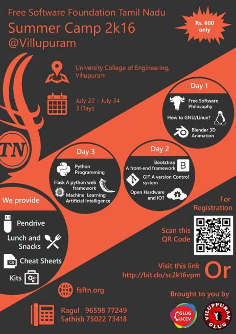

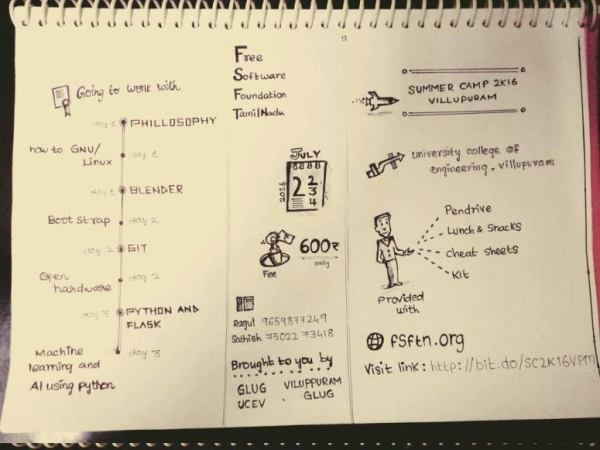{:height="300px" width="450px"}
 
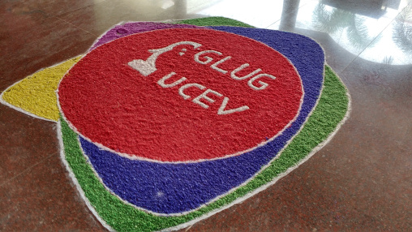{:height="300px" width="450px"}

**Summer Camp 2k16** was conducted on **22nd June to 24th June, 2016** at **University College of Engineering, Villupuram**. We (**Me**, [**Ragul Kanth**](https://ragulkanth.github.io), [**Manimaran**](https://manimaran96.wordpress.com/)) have organized the event. This is one of the mega event conducted at Villupuram powered by [**FSFTN**](https://fsftn.org) through **GNU/Linux Users Group - Villupuram** and **GNU/Linux Users Group - UCEV**. This is an Three day Workshop on various Free Software technologies such as Blender, GNU/Linux, Bootstrap, Python etc. 

##**A step forwared for Summer Camp 2k16**

The Work was started before a month from the event. The first planning was made on June 5, 2016 with few activist of FSFTN. Later it was followed and works started blooming. We have decided to conduct the event at July 22, 23 and 24, 2016. The Activist from University College of Engineering, Villupuram and IFET College of Engineering was paid their whole interest. 

##Registration plan

We have planned to collect Rs 600 each for providing them pendrive, food, snacks, cheat sheets and certificate. For registration we have selected an ambassadors from various colleges. Students from those colleges could register through respective ambassadors. We also had a public venue for other peoples at **Vel Tech Computers**, Villupuram. 

##Work Efforts

Venue confirmation work gets started first. We have approached **Dr. Senthil, Dean, UCEV** for getting venue at UCEV. Successfully we got permission for conducting the camp in our college with food and accommodation for volunteers. 
And then **Designing work was started**. We have started designing the web page immediately after confirming the venue. We also created the poster and distributed to various colleges in Villupuram. Volunteers also designed small mimes and shared in the social medias for promoting the event.
Once all those works got completed, we went to many colleges in Villupuram such as **Mailam Engineering College, AR College of Engineering, VRS College of Engineering and Technology, University College of Engineering, Panruti, University College of Engineering, Tindivanam, Surya College of Engineering**, etc. and approached the HOD of CSE and ECE dept. and explain about  FSFTN and Summer Camp. They allowed us to meet their students and explain about the workshop. We went to the class rooms and explained about the Technical topics we have enveloped in this camp. Really we got good response from them.

##Registration

Registration was started on **11th of July**. We have started to inform the colleges around Villupuram and we have selected one among them as a ambassador (Also gave importance for the people who have already attend the GLUG meetups and had a prior knowledge about our activities). We have fixed 18th July as a last date but later we have extended upto 20th July. The ambassadors are provided with a registration book  which need to be filled with the participant details who are registering for the Summer Camp. We have provided one book per college with 30 tickets (slip in the book) but we are made to give additional books as more than 30 peoples was eagerly registered (Some colleges). Finally we have collected the amount and registration book from the ambassadors and created the overall list of the participants. **Total registration was 156**.

##Action Plan

We have plan to separate the participants into various groups. Each group contains 8 members from various colleges, various departments and various year with equal count of boys and girls. Each groups is leaded by our volunteers. There are about 29 groups. The volunteers had prior knowledge about the technologies that was taken in various sessions. So that, participants can ask their doubts to their volunteer who will be as one among them. It was really a successful attempt. This also helps the speakers as well as the participants. We made fully hands on sessions, participants are adviced to bring laptops. [**Ragul Kanth**](https://ragulkanth.github.io) **customized the GNU/Linux Operating System** with the nessesary packages such as Blender, Flask, etc. **Mr. Balaji** took responsible for the speakers.

##Previous day effors

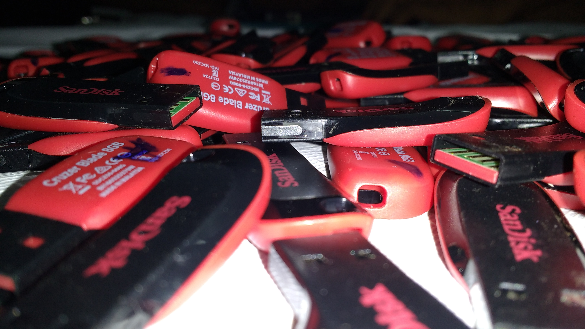{:height="300px" width="450px"}

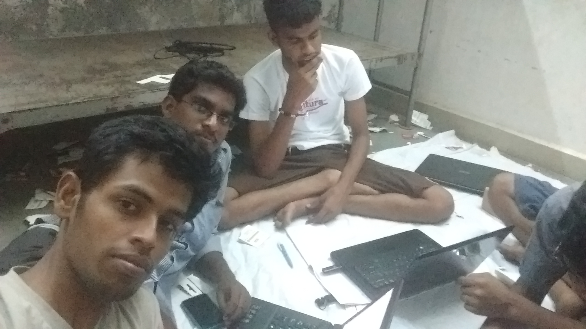{:height="300px" width="450px"}

On previous day We were went to get the gifts and other necessary things for the next day innauguration function. **Mr. Balaji** took responsible for the ID card and Kits for the particiapants. **Manimaran, Saran Kumar, Farooq Khan, Ragul Kanth, etc.** were joined and wrote the customized operating system in the pendrives. **Me with Manimaran** Divided the participants into different groups. **Isakki raja, Hari Priya, Anandha Krishnan and Sai Kumar** Helped us in all the circumstence. Girls such as **Keerthana, Bagya, Dhanalakshmi etc.** were draw the rangoli in the entrance and decorated that. Volunteers such as **Ranjitha, Harini, Gayathri and Dinesh from IFET College of engineering** joined with us and helped us in purchsing the things for innaugural function and also helped in registration. It was a coordinated work of many people. 

##**Day 1:**

####Inauguration

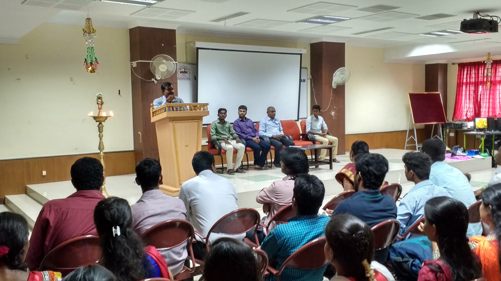{:height="300px" width="450px"}

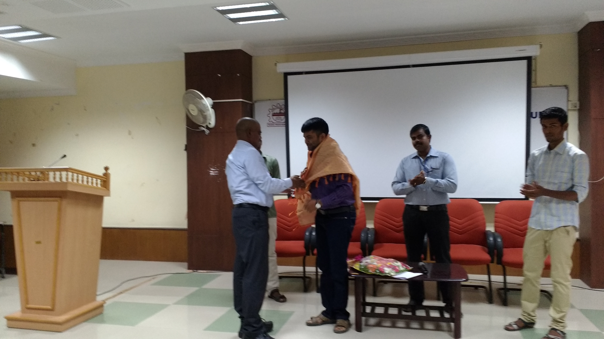{:height="300px" width="450px"}

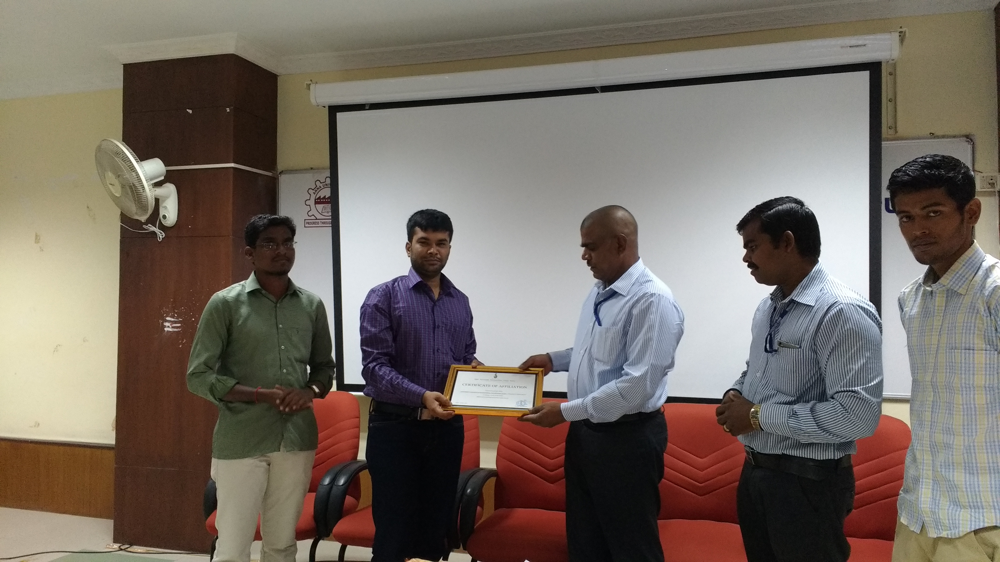{:height="300px" width="450px"}

Summer Camp 2k16 was Inaugurated by **Mr. Sibi Kanagaraj, Secratery, FSFTN**, **Dr. Senthil, Dean, UCEV**, **Mr. P. Arjun, HOD i/c, CSE, UCEV**. Participants and the volunteers were gathered for the inaugural function. During the innaugural function, We got an **Affilation certificate** from **Mr. Sibi Kanagaraj** that the **GLUG-UCEV** was get affilated to FSFTN. After the inaugural function the stage persons were delevered a speach.

####Free Software Philosophy

As usual, This event also get started with free software philosophy. **Mr. Sibi Kanagaraj** handled the philosophy session. Short and sweetly he said the four freedoms and he said what is free software and why we need to use free softwares and why we are promoting that. The freedom includes, *You can read, run the program for any purpose and can distribute the modified or unmodified verions of the software*. 

####Shell Scripting

Followed by the Philosophy session He handled the Shell Scripting. He said few shell commands participants were followed and executed the commands. He covered the basic commands which the participants will use frequently. Thus it helped to make them feel comfortly with GNU/Linux.

####GIT and Open Hardware

**Mr. Prasenna Venkatesh** handled the GIT and Open Hardware session. He explained how to work collabratively using GIT. GIT is a *Version Control System*. He explained few GIT commands as follows

1. git init => initiate the git in particular folder. That is, once this command was executed, the current working folder will tracked by the git.
2. git clone => This command will be executed along with the url. This command is used to clone (Make a copy) the project or file form the specific url.
3. git add => This command will be executed along with file name. This will add the changes (creation, edition, deletion, modification of a file) made in that folder to the git.
4. git commit => This will be executed alog with *-m "Message"*. This will save the changes that added to the git using the previous command and in message, the changes what we have made will be specified, so that others can understand the current status of that project.
5. git push => This command will push the edited or modified or updated project to the central repo.
6. git pull => This command will pull the new updates from the url where it was cloned.

The above are the few basic commands of GIT. After compleated the GIT session, he continued with the Open Hardware session. On this session he explained about **Arduino** (A prototyping hardware). Arduino is an open hardware. In the sense that, Its Schemas are available openly and hence it is called as Open Hardware. There are also other few open hardwares available such as *Beagle Bone BLack*, etc. He concluded with the **IOT** and the **Community Weather Station** they have installed in **Pondicherry**. 

####Discussion

Once the sessions were came to end, after all the participants left, we along with all the volunteers including speakers, had the general discussion about the sessions and the participation of participants. Some were new to the volunteering, so we had made them to share their experince. We also collected the feedback form the participants before they are leaving. The day was quite successfull. 

##**Day 2:**

####Bootstrap:

Next day Bootstrap was at the morning session. **Mr. Ashwin** Handled the Bootstrap session. He was started with some basics of HTML since some students from other than computer feiled was there. after he moved to the CSS and then to the Bootstrap. Bootstrap was totaly unaware to them. It is an frontend web frame work developed by *Twitter developers*. It contains many pre defined styles, we can use those styles by simply calling that class using the class id. Its quite awesome which reduce the time span for developing the fronend.

####Blender:

Blender was an AN session. **Mr. Vignesh** handled the blender session. *Blender is an 3D animation suit*. It was really attractive tool make every on to be seated at the corner of their seats while rendering the final image. He concentrated on each and everyone and clarified the doubts of the participants. 

####Discussion
As usual the discussion was made along with the volunteers and the speakers. We have jointly readed the feedback of the participants. They have liked the blender session more, since, it was a graphical design which induices their creativity. Volunteers really felt comfort with the participants and they were so interactive within themselves. 

##**Day 3:**

####Python and Flask:

Third day sessions was fully engaged with **Python and Flask** handled by **Mr. Sooriya deepan and Mr. Selva**. Pre session was conducted for the volunteers so that they can easily clarify the participants doubt. Mr. Selva demonstrated the python and Mr. Sooriya deepan handled the session. It was started with the basics of python. Participants simultaneously executed the python statements in **Ipython interpreter**. After completing the basics of python Mr. Sooriya deepan and Mr. Selva moved to the Flask. Before that they have explained what is  frontend and what is backend and also what is request and what is response so that participants can clearly understand the role of request and response in Flask. Participants were felt happy while seeing the output of the flask in the web browser. 

####Machine Learning:

Mr. Sooriya deepan explained what is machine learning and how the machine learns. Due to low time period, he has to be rush up the session and it was went like a one man show but quit interactive. He explained **What is nural network and how it will be**. Finally he showed an example for nural network that **Google used to recoginize the animals**. The session was ended up with feedback talk.

##**Certificate Distribution:**
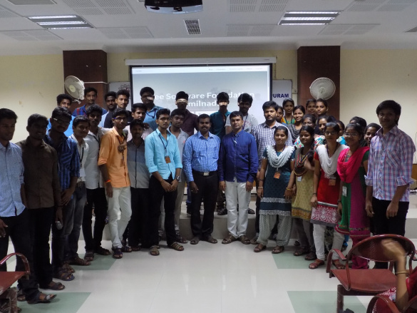{:height="300px" width="450px"}

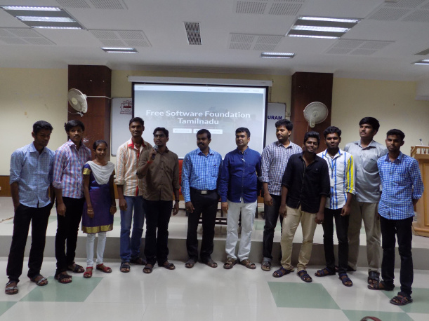{:height="300px" width="450px"}

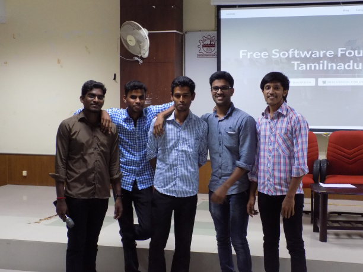{:height="300px" width="450px"}

At last we came to the end part of the Summer Camp 2k16, Villupuram. We have invited **Mr. Sibi Kanagaraj, Secretary, FSFTN, Mr. Arjun, HOD, CSE Dept., Mr. Regan, Asst. Prof. CSE Dept.,** for the certificate distribution. We have called any one from the participants to give a feed back about the event. They said this was the first event that they have attended where peoples from vaious colleges grouped and guided by the volunteers. After that we started to distribute the certificates. Team members has to come along with the team volunteer to get the certificate. They were learned a lot and enjoyed a lot. I have thanked the volunteers from various colleges, College ambassedors, participants and who have did the backend work etc. Finally we have put an end with the National Anthem. 

At last we have took the group photo along with all the participants and volunteers.

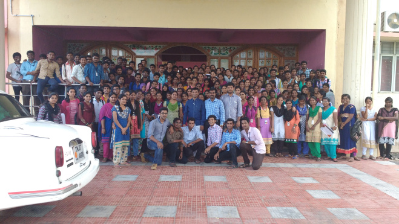{:height="400px" width="600px"}

###Thankful to:

* **UCEV administration** (Provided full support, venue for conducting the event)
* **UCEV Hostel management** (Provided accomodation and food for the volunteers and participants)
* **UCEV non teaching staffs** (Served us in all aspects such as tea and snacks distibution and mic set handling)
* **Vel Tech Computers** (Provided public venue for the registration)
* **UCEV Volunteers**
* **IFET Volunteers** 
* **Villupuram GLUG Volunteers**
* **FSHM Volunteers**
* **SKP volunteers** (Came from thiruvannamalai and stayed and worked with us for all three days)
* **Annamalai canteen** (Provided tea and snackes)
* **Ambassedors** (Helped us in registration)

