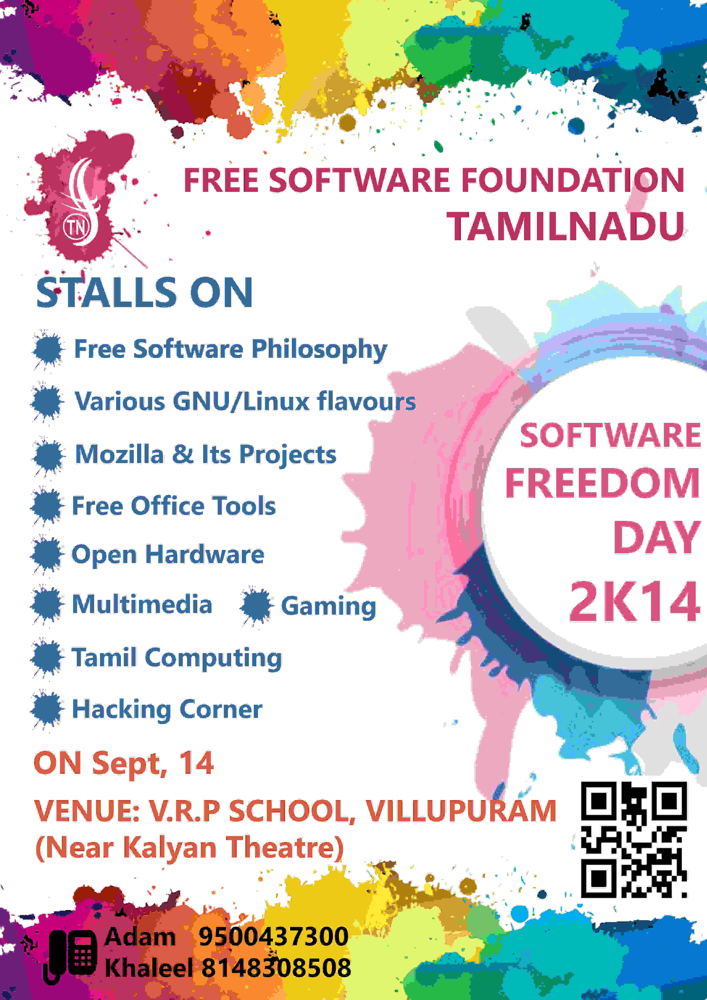

Title:Software Freedom Day 2014
Date: 2014-09-18 10:20
Category: Post
{:height="450px" width="300px"}

Software Freedom Day is an public event creating awareness about Free Softwares and its Licence policies. Great experiece we got in volunteering such a public event. It was conducted on **Sep 14, 2014**
at VRP Matriculation Higher Sec. School, Villupuram. at that contains various stalls each contains various Free Software stuffs to explain public. **I have explained about various distributions on GNU/Linux** on a seperate stalls. That was our first experience on public event. Many people from our college took part in that event. You can see the list of stalls we installed there on the above pic. 

Peoples were asked various questions on Licenses and Why they need to use GNU/Linux, while having Windows. That was the first question which made me to learn more about Licences of softwares. We got more experienced people such as **Mr. Sibi Kanagaraj**, **Mr. Yogesh** and **Mr. Balu** explained more detailed about GPL and EULA. 
