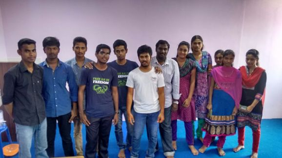

Title:Software Freedom Day 2015
Date: 2015-10-01 10:20
Category: Post
{:height="300px" width="450px"}

Same as in 2014, Software Freedom Day was conducted successfully on **Sep 27, 2015**. This year We (**Me**, [**Ragulkanth**](ragulkanth.github.io), [**Manimaran**](https://manimaran96.wordpress.com)) organized the event. It was conducted at *Jeevika Academy, Villupuram* [**Ragulkanth**](ragulkanth.github.io) Gave an introduction about Python and **My sef** said an Philosophy behind Free Software and **Priyadharshini** took Blender session. Really went Good. 
