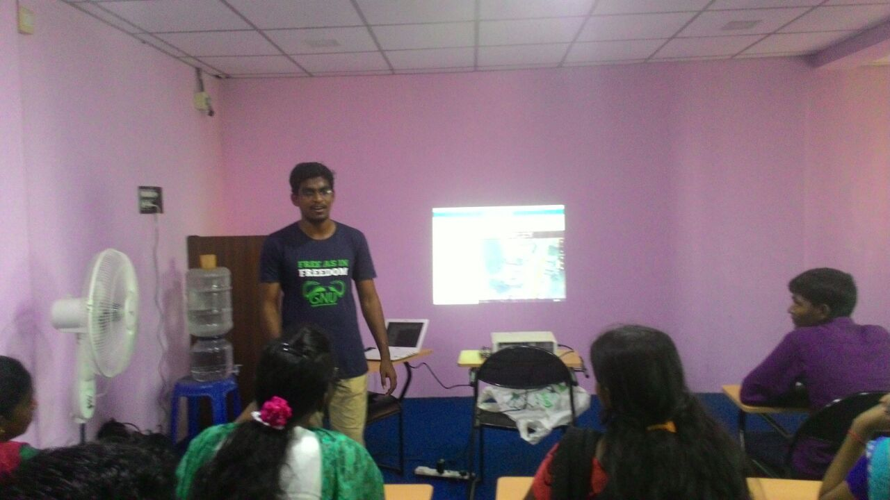
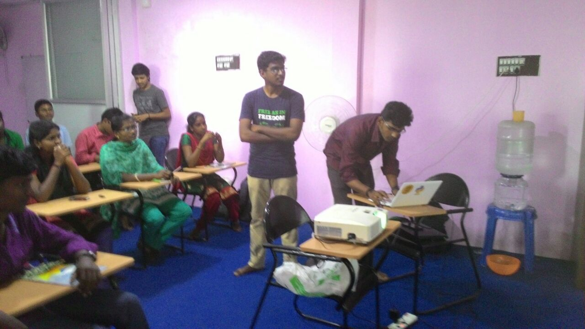

Title:Weekathon #1
Date: 2016-02-05 10:20
Category: Post
{:height="300px" width="450px"}

{:height="300px" width="450px"}

Weekathon is a weekly technical meetup by GNU/Linux Users Group, Villupuram. We have organizing these technical meetups where we discuss and share knowledge about various technologies. It was conducted on *Feb 02, 2016* [**Ragulkanth**](ragulkanth.github.io) took **bootstrap** session. I have took **Open Street Map**. Open Street Map is an alternate to Google maps. In this map Users are the contributors. Users can mark their own places and they can use the map for any purpose. Shortly, OSM is awesome!
